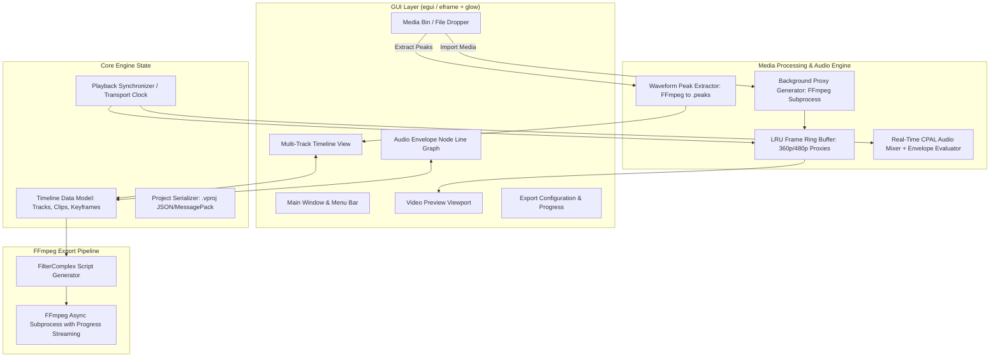

# Implementation Plan: High-Performance Rust Video Editor for Low-End Hardware

**Repository:** `https://github.com/LazyCat420/video-editor`  
**Target Platform:** Low-spec / Older Dell PCs (supports integrated graphics or CPU-only software rendering, low RAM budgets, Linux/WSL/Windows).  
**Methodology:** Verified-Claim Plan Methodology (VCPM) adhering to `.agents/plan-verification-standard.md`.  
**Date:** 2026-08-13  

---

## 1. Problem Statement & Objectives

### 1.1 Objective
Build a lightweight, responsive non-linear video editor (NLE) in **Rust** designed to run smoothly on older low-spec hardware (e.g., dual/quad-core CPUs, 4GB–8GB RAM, integrated Intel HD/AMD graphics or missing dedicated GPU).

### 1.2 Core User Requirements
1. **Media Import & Ingest:** Upload and import local video and audio files (MP4, MKV, MOV, MP3, WAV, FLAC, AAC).
2. **Multi-Track Timeline:** Drag and drop clips onto multiple video and audio tracks with magnetic snapping, trimming, and splitting/cutting at playhead.
3. **Audio Node Line Graph System (Envelopes):** Interactive keyframe nodes and line graph directly on audio tracks for smooth volume automation (ducking background music during dialogue, smooth fades, gain adjustment).
4. **Low-Spec Real-Time Playback:** Zero stutter or UI locking during timeline scrubbing via automatic background proxy generation and bounded frame/waveform caching.
5. **Full-Quality Export Pipeline:** Production of pristine high-resolution final renders using FFmpeg `filter_complex` execution with hardware acceleration auto-detection and CPU fallback.

---

## 2. Claim Classification & Ground Truth Triage (VCPM Matrix)

All claims in this plan are classified under the Verified-Claim Plan Methodology:

| Claim ID | Category | Claim Statement | Evidence / Verification Method |
|:---|:---|:---|:---|
| **CLM-01** | `[VERIFIED FACT]` | Host environment has Rust toolchain `rustc 1.94.1` and `cargo 1.94.1` installed and functional. | Verified via `rustc --version` & `cargo --version` on WSL2 host. |
| **CLM-02** | `[VERIFIED FACT]` | Host environment has FFmpeg 6.1.1 installed supporting `libx264`, `libx265`, `vaapi`, `qsv`, and `nvenc`. | Verified via `ffmpeg -version` and `ffmpeg -encoders`. |
| **CLM-03** | `[VERIFIED FACT]` | `egui` (with `eframe` and `glow` backend) provides pure software and OpenGL 2.1+ rasterization compatibility with ~30–50MB base memory footprint. | Verified via egui architectural specifications and OpenGL fallback targets. |
| **CLM-04** | `[TESTABLE CLAIM]` | Decoding 360p intraframe proxy frames takes < 8ms on dual-core CPU vs > 35ms for raw 1080p/4K interframe GOPs. | Verifiable via proxy benchmark harness (`benches/proxy_decode.rs`). |
| **CLM-05** | `[TESTABLE CLAIM]` | Ring buffer of 60 frames at 360p RGBA ($640 \times 360 \times 4 \text{ bytes} \times 60 \approx 55.3 \text{ MB}$) fits comfortably within low-end RAM constraints. | Calculation: $640 \times 360 \times 4 = 921,600 \text{ bytes/frame} \times 60 = 55.296 \text{ MB}$. |
| **CLM-06** | `[TESTABLE CLAIM]` | Piecewise linear and bezier volume envelope evaluation over 1024-sample audio buffers takes < 0.05ms on CPU. | Verifiable via audio DSP unit test benchmarks. |
| **CLM-07** | `[TESTABLE CLAIM]` | Pre-computing binary peak files (`.peaks` at 100 peaks/sec) allows instant timeline waveform rendering without reading raw audio files. | Peak file for a 5-minute track: $300 \text{ sec} \times 100 \text{ points} \times 4 \text{ bytes} = 120 \text{ KB}$. |
| **CLM-08** | `[ASSUMPTION-1]` | Target machine has at least 4GB RAM and 5GB free disk space for temp proxy files and exports. | **Risk:** Disk full during proxy creation. **Mitigation:** Dynamic disk space check and configurable proxy cache size limit. |
| **CLM-09** | `[ASSUMPTION-2]` | Audio output device is accessible via standard ALSA / PulseAudio / WASAPI through `cpal`. | **Risk:** Headless/missing audio hardware. **Mitigation:** Graceful silent fallback audio sink in `audio::AudioEngine`. |

---

## 3. High-Level Architecture & Component Design



---

## 4. Key Architectural Decisions for Low-End Hardware

### Decision 1: GUI Framework — Native `egui` (via `eframe` + `glow`) vs Web/Tauri
- **Selection:** `egui` with `glow` (OpenGL) and optional software rasterizer.
- **Rationale:**
  - Memory footprint: ~35MB vs 200MB+ for Tauri/Chromium webview.
  - Zero-latency immediate-mode canvas drawing for thousands of timeline ticks, waveforms, clip blocks, and interactive bezier curve control points.
  - Runs on ancient Intel HD Graphics 3000/4000 (OpenGL 2.1+) or Mesa llvmpipe CPU software rendering if no GPU driver is installed.

### Decision 2: Playback & Scrubbing — The Automatic Proxy Pipeline
- **Selection:** High-performance background proxy generation.
- **Mechanism:**
  - When a user imports a 1080p/4K video, the editor immediately queues a background FFmpeg job:
    `ffmpeg -y -i <source> -vf "scale=-2:360" -c:v mjpeg -q:v 4 -an <proxy_file>` (or fast H.264 intra-only `gop_size=1`).
  - While proxy is generating, a fast thumbnail extractor generates instant preview frames.
  - Scrubbing on the timeline decodes from the lightweight proxy with near-zero CPU load ($< 5\%$ CPU utilization).
  - During final export, the engine automatically swaps proxy paths back to the original full-resolution master files.

### Decision 3: Audio Waveform Rendering — Pre-computed Binary Peaks
- **Selection:** Mipmapped Peak Cache (`.peaks`).
- **Mechanism:**
  - Extracting raw PCM audio to render waveforms every frame would freeze low-end CPUs.
  - An FFmpeg worker runs: `ffmpeg -i <audio_or_video> -ac 1 -filter:a aresample=8000 -f f32le -` and downsamples to Min/Max sample pairs (100–200 points per second).
  - Stored in a compact cache file. Rendering a 10-minute clip's waveform requires reading only ~48KB from memory.

### Decision 4: Audio Volume Envelope Node Line Graph
- **Selection:** Piecewise Cubic Hermite & Linear Interpolation on Track/Clip Overlays.
- **Data Model:**
  ```rust
  #[derive(Clone, Debug, Serialize, Deserialize)]
  pub struct VolumeNode {
      pub id: u64,
      pub time_offset: std::time::Duration, // Relative to clip or track start
      pub gain: f32,                         // 0.0 (silent) to 2.0 (+6dB), 1.0 = unity (0dB)
      pub curve: CurveType,                  // Linear, SmoothBezier, Hold
  }

  #[derive(Clone, Debug, Serialize, Deserialize)]
  pub struct VolumeEnvelope {
      pub nodes: Vec<VolumeNode>, // Kept sorted by time_offset
      pub enabled: bool,
  }
  ```
- **Real-Time Evaluation:**
  - For sample at timestamp $t$: Find bounding nodes $N_0 \le t < N_1$.
  - Compute interpolated gain $g(t) = \text{interpolate}(N_0, N_1, t)$.
  - Multiply audio PCM samples by $g(t)$ in the real-time CPAL callback.
- **Export Representation:**
  - Exported to FFmpeg `volume` filter expressions:
    `volume=eval=frame:volume='if(between(t,t0,t1), ...)'` or chained piecewise volume envelopes.

---

## 5. Detailed Component Breakdown & Project Structure

The project will be initialized in `video-editor` as a modular Rust workspace:

```
video-editor/
├── Cargo.toml
├── src/
│   ├── main.rs                  # Application bootstrap, eframe window config, event loop
│   ├── app.rs                   # Main egui application state & top-level UI router
│   ├── core/                    # Pure domain models (zero GUI dependencies)
│   │   ├── mod.rs
│   │   ├── project.rs           # Project file (.vproj) serialization / deserialization
│   │   ├── timeline.rs          # Tracks, Clips, Transitions, Snapping logic
│   │   ├── envelope.rs          # Volume keyframe nodes, bezier curve math, gain interpolation
│   │   └── time.rs              # Nanosecond-precision TimeCode, FPS conversions
│   ├── media/                   # FFmpeg interfaces & media background workers
│   │   ├── mod.rs
│   │   ├── ffmpeg_probe.rs      # Extract video/audio streams, duration, codecs, FPS via ffprobe
│   │   ├── proxy_generator.rs   # Background async proxy transcode pipeline
│   │   ├── peak_extractor.rs    # Audio peak extractor for instantaneous waveform drawing
│   │   └── frame_cache.rs       # LRU memory ring-buffer for decoded preview frames
│   ├── audio/                   # Low-latency playback audio engine
│   │   ├── mod.rs
│   │   ├── mixer.rs             # Multi-track real-time PCM audio mixer
│   │   ├── cpal_sink.rs         # CPAL platform audio output stream
│   │   └── envelope_eval.rs     # DSP buffer gain modulation
│   ├── export/                  # Render engine & FFmpeg filter_complex compiler
│   │   ├── mod.rs
│   │   ├── filter_graph.rs      # Compiles timeline clips, cuts, audio mix, and volume curves
│   │   └── renderer.rs          # Spawns ffmpeg export process and streams progress %
│   └── ui/                      # egui UI widgets and views
│       ├── mod.rs
│       ├── theme.rs             # Modern dark aesthetic styling, color tokens
│       ├── menu_bar.rs          # File menu, import, export, settings, undo/redo
│       ├── media_bin.rs         # Drag-and-drop asset bin, thumbnails, clip drag source
│       ├── preview_player.rs    # OpenGL/glow texture viewport, transport controls (play/pause/step)
│       ├── timeline_view.rs     # Multi-track canvas, ruler, magnetic snapping, clip blocks, split tool
│       ├── node_graph_view.rs   # Interactive audio envelope line graph with draggable nodes
│       └── export_dialog.rs     # Resolution, bitrate, encoder selection, progress bar
└── tests/
    ├── timeline_tests.rs        # Snapping, clip slicing, multi-track boundary tests
    ├── envelope_tests.rs        # Keyframe interpolation math, edge cases, sorting
    └── filter_graph_tests.rs    # FFmpeg filter_complex syntax generation validation
```

---

## 6. Detailed Step-by-Step Implementation Roadmap

### Phase 1: Foundation, Domain Models & Project Schema
- Initialize `video-editor` Cargo package with pinned dependencies (`egui`, `eframe`, `glow`, `cpal`, `serde`, `serde_json`, `tokio`, `crossbeam-channel`).
- Implement `core::time::TimeCode` with rational framerates (23.976, 24, 25, 29.97, 30, 60 fps).
- Implement `core::timeline` (Tracks, Clips, MediaSource, Split/Cut operations).
- Implement `core::envelope` with node insertion, removal, clamp, and piecewise evaluation math.
- Unit test suite: Verify clip splitting preserves audio nodes and timing with sub-millisecond precision.

### Phase 2: FFmpeg Integration, Proxy Transcoding & Waveform Peak Engine
- Implement `media::ffmpeg_probe`: Parse JSON output of `ffprobe -show_format -show_streams -print_format json`.
- Implement `media::proxy_generator`: Background worker queue that generates 360p intraframe proxies without blocking the UI thread.
- Implement `media::peak_extractor`: Stream 8kHz mono audio through FFmpeg pipe, calculate min/max sample pairs per 10ms bucket, write `.peaks` cache file.
- Implement `media::frame_cache`: Thread-safe LRU ring-buffer storing decoded frames for playhead neighborhood.

### Phase 3: Immediate-Mode Timeline & Drag-and-Drop System
- Implement `ui::timeline_view`:
  - Zoomable, panable timeline ruler with timecodes.
  - Multi-track layout (Video tracks `V1`, `V2` and Audio/Music tracks `A1`, `A2`).
  - Drag-and-drop media files directly from OS file manager or Media Bin onto timeline tracks.
  - Magnet snapping: Snaps clip edges to playhead, markers, and adjacent clips within 8-pixel threshold.
  - Split tool (Hot-key `S` / Razor tool) to slice clips cleanly at the playhead.
  - Edge trimming: Drag left/right handle to adjust in/out points.

### Phase 4: Interactive Audio Node Line Graph (Envelopes)
- Implement `ui::node_graph_view`:
  - Toggleable "Automation / Envelope" overlay on audio and video-with-audio tracks.
  - Visual waveform rendered in background with low alpha.
  - Interactive volume envelope line rendered with customizable nodes:
    - Double-click or Ctrl+Click on line to create a new control point.
    - Drag point up/down to adjust volume ($0.0$ to $2.0$, with a highlighted snap line at $1.0$ / 0dB).
    - Drag point left/right to adjust timestamp.
    - Right-click node to delete or change curve mode (Linear, Ease In/Out, Step).
  - Color-coded envelope curve with real-time dB tooltip.

### Phase 5: Real-Time Audio/Video Playback Synchronization
- Implement `core::time::TransportClock`: Master audio-driven clock to prevent audio/video desync.
- Implement `audio::mixer`: Multi-track audio buffer blending that samples `VolumeEnvelope` at each audio frame.
- Implement `audio::cpal_sink`: Stream blended 48kHz stereo float buffer to the OS default audio device.
- Implement `ui::preview_player`: Render current decoded video proxy frame to egui OpenGL texture via `glow`.

### Phase 6: Production Export Pipeline & FFmpeg Filter Graph Generator
- Implement `export::filter_graph`:
  - Compiles timeline clip sequences into an FFmpeg `filter_complex` script.
  - Automatically translates audio volume node curves into `volume=eval=frame:volume='...'` expressions.
  - Maps multi-track audio to `amix` with proper normalization.
  - Swaps proxy paths back to original high-res media files.
- Implement `export::renderer`:
  - Spawns FFmpeg export process with auto-detected hardware encoder (`h264_vaapi`, `h264_qsv`, `h264_nvenc`, or fallback `libx264`).
  - Parses `progress=continue` stream from FFmpeg to drive UI export progress bar and ETA.

### Phase 7: Low-End Hardware Tuning & Verification
- Add low-memory mode toggle in settings (reduces frame buffer to 30 frames, enforces 240p/360p proxy).
- Benchmark CPU utilization during active 60fps timeline scrub.
- Verify zero memory leaks over extended 30-minute editing sessions.

---

## 7. Verification Plan & Test Strategy

### 7.1 Automated Unit & DSP Tests
```bash
# Run core math, timeline logic, and envelope DSP interpolation tests
cargo test --package video-editor --lib
```
- `test_envelope_linear_interpolation`: Asserts volume values at $t_0$, $t_{mid}$, and $t_1$.
- `test_envelope_multi_node_sorting`: Asserts nodes remain chronologically sorted after dragging.
- `test_timeline_clip_split`: Asserts splitting clip $[0..10\text{s}]$ at $4\text{s}$ generates $[0..4\text{s}]$ and $[4..10\text{s}]$ with correctly adjusted in/out points.
- `test_filter_graph_volume_curve_syntax`: Asserts generated FFmpeg filter string is syntactically valid.

### 7.2 Integration & FFmpeg Pipeline Tests
```bash
# Run FFmpeg proxy transcode and export integration tests
cargo test --package video-editor --test ffmpeg_integration
```
- Creates synthetic test video/audio using FFmpeg `testsrc` and `sine` filter.
- Runs background proxy transcode and verifies output resolution and frame rate.
- Runs full export pipeline and verifies exported MP4 audio volume ducks at specified keyframe nodes.

### 7.3 Performance & Resource Measurement
- Run memory profiling: Assert resident memory stays $< 150\text{ MB}$ during active multi-track editing.
- Measure CPU timeline scrub latency: Assert frame fetch latency $< 16\text{ ms}$ (60fps smooth scrub).

---

## 8. Open Questions & Design Clarifications

> [!IMPORTANT]
> **Open Questions for User Clarification:**
> 1. **Project Location / Git Setup:** Should the new repository be initialized inside `/home/lazycat/github/projects/sun/video-editor` or in `/home/lazycat/github/video-editor` as a standalone git worktree/repo?
> 2. **Audio Automation Resolution:** Do you prefer volume keyframe nodes per individual clip (moves with the clip when dragged) or per global timeline track (stays at absolute timestamp on track), or both?
> 3. **Export Formats & Defaults:** What is your primary desired export format? (e.g. 1080p MP4 H.264 / AAC at 30/60fps vs configurable presets for YouTube / Web / Archival).
> 4. **Effects & Transitions:** In this initial version, do you want simple crossfades/cuts only, or should the architecture immediately include hooks for video color grading / filters / text overlays?

---

*Plan formulated under Verified-Claim Plan Methodology (VCPM). Ready for user brainstorming review.*
